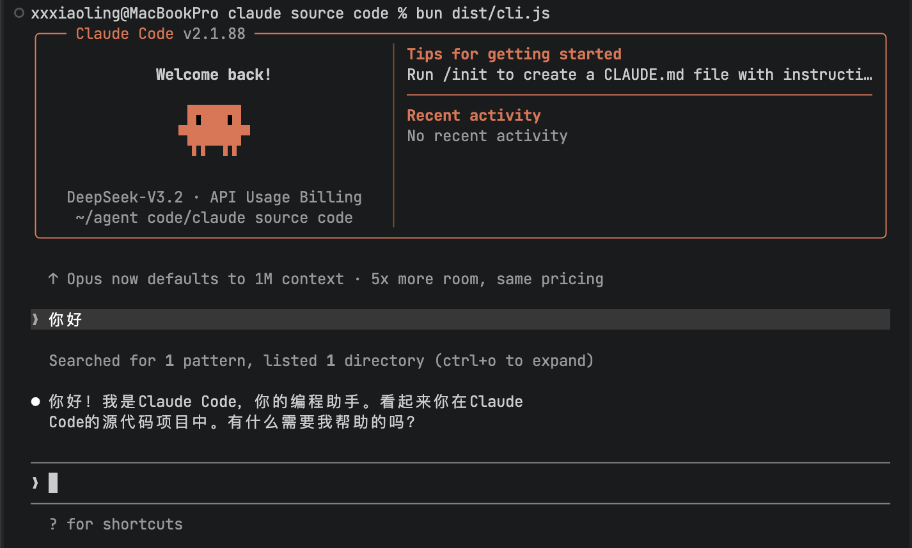

# Claude Code 2.1.88 Source Recovery

<p align="center">
  
  
  
  
</p>

## 从源码重新构建

```bash
# 1. 安装 Bun（构建工具）
curl -LO https://github.com/oven-sh/bun/releases/latest/download/bun-darwin-aarch64.zip
unzip bun-darwin-aarch64.zip -d /tmp/bun && sudo cp /tmp/bun/bun-darwin-aarch64/bun /usr/local/bin/bun

# 2. 安装/更新依赖
pnpm install --registry https://registry.npmjs.org
```

### 1) 安装依赖

```bash
bun install
```

这一步会根据 `package.json` 安装公开依赖。

### 2) 应用恢复补丁

```bash
bun run setup:recovery
```

该脚本会自动完成两类操作：

- 创建私有包存根（写入 `node_modules`）
  - `@ant/claude-for-chrome-mcp`
  - `@anthropic-ai/mcpb`
  - `@anthropic-ai/sandbox-runtime`
  - `color-diff-napi`
  - `modifiers-napi`
- 自动打 `commander` 兼容补丁（允许 `-d2e`）

脚本位置：`scripts/setup-recovery.mjs`

### 3) 构建

```bash
bun run build
```

构建入口：`src/entrypoints/cli.tsx`\
产物目录：`dist/`

### 4) 运行验证

```bash
bun dist/cli.js --version
bun dist/cli.js --help
bun dist/cli.js
```

使用CC Switch可自动切换为DeepSeekV3.2




---

## 免责声明

- **非官方项目**：本仓库并非 Anthropic 官方仓库，亦不代表其立场。
- **版权说明**：原始代码的版权、商标及相关权利归原权利方（Anthropic）所有。
- **研究用途**：本项目仅供归档、结构分析与源码阅读，不应被视为官方开源项目。
- **法律风险**：如需二次发布或商用，请自行评估相关许可与法律风险。

---


