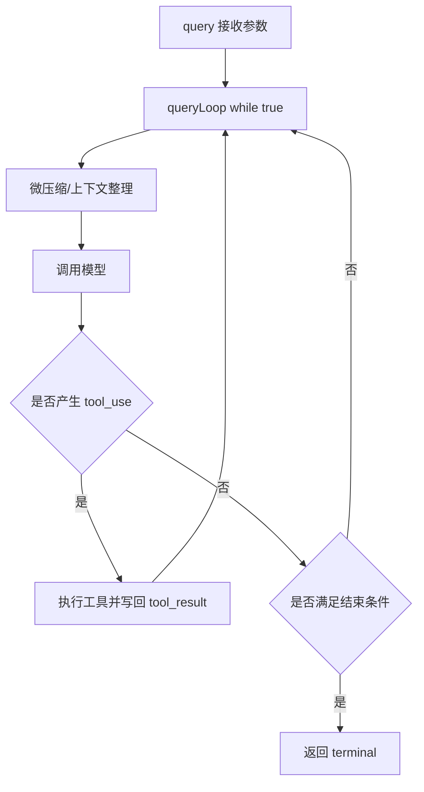

# 01. Agent Loop：从 Prompt 到完成任务 🔁

## 🎯 整体架构

Agent Loop 的核心是一个「持续推进直到可结束」的迭代器：

1. 接收当前输入（system prompt + user context + messages）
2. 进入 `while (true)` 主循环
3. 每轮做上下文整理、模型调用、工具执行、消息回填
4. 命中终止条件后返回 `Terminal`

它由 `query()` 调度，`queryLoop()` 执行，支持主线程与子 Agent 复用。

## 🔄 运行流程



## 🧩 设计要点

- 主循环状态集中在 `state`，每轮顶部解构，避免散落的可变变量。
- 将「请求开始」「压缩阶段」「执行阶段」打点，便于性能分析与故障定位。
- 支持同一循环框架承载主线程、子 Agent、fork 场景。
- 通过 `maxTurns`、中断状态等机制保证可控退出。

## 💻 代码举例

```ts
async function* queryLoop(params, consumedCommandUuids) {
  let state = {
    messages: params.messages,
    toolUseContext: params.toolUseContext,
    turnCount: 1,
  }

  while (true) {
    let { toolUseContext } = state
    const { messages } = state
    yield { type: 'stream_request_start' }
  }
}
```

## 🛠 持续更新

- 新增终止条件时，同步更新「运行流程」图。
- 新增循环阶段时，补齐阶段职责与失败回退路径。
- 保持示例代码与 `src/query.ts` 行为一致。
