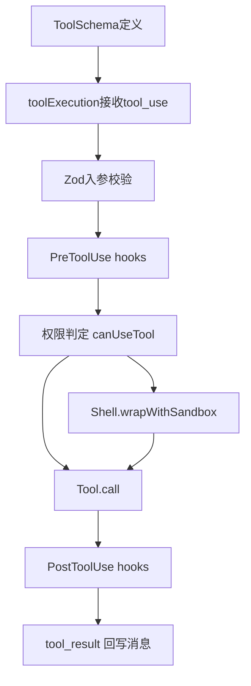

# 02. Tool 与沙箱：怎么定义、执行、保证安全 🛡️

## 🎯 整体架构

这一层分成三块：

1. **工具定义层**：约束输入输出、权限属性、并发属性。
2. **工具执行层**：校验 → Hook → 权限判断 → 执行 → 回写结果。
3. **沙箱防护层**：对 Bash 等高风险能力进行路径、命令、文件系统隔离。

## 🔄 运行流程



## 🧩 设计要点

- 工具通过统一 `Tool` 类型注册：`inputSchema`、`call`、`isReadOnly`、`isConcurrencySafe`。
- 先做 schema 校验，再做语义校验，减少模型参数幻觉带来的破坏。
- Bash 有二次防御：模型偷偷传 `_simulatedSedEdit` 也会被剥离。
- 沙箱默认拒绝高风险写入路径（如 settings、skills 等），并处理裸仓库投毒路径。

## 💻 代码举例

```ts
const parsedInput = tool.inputSchema.safeParse(input)
if (!parsedInput.success) {
  return toolUseError('InputValidationError')
}

const isValidCall = await tool.validateInput?.(parsedInput.data, toolUseContext)
if (isValidCall?.result === false) {
  return toolUseError(isValidCall.message)
}
```

```ts
if (tool.name === BASH_TOOL_NAME && '_simulatedSedEdit' in processedInput) {
  const { _simulatedSedEdit: _, ...rest } = processedInput
  processedInput = rest
}
```

## 🛠 持续更新

- 每次新增工具字段时，补充本页“工具定义层”说明。
- 每次新增 deny/allow 策略时，补充沙箱规则变化。
- 与权限系统联动变更保持同步记录。
