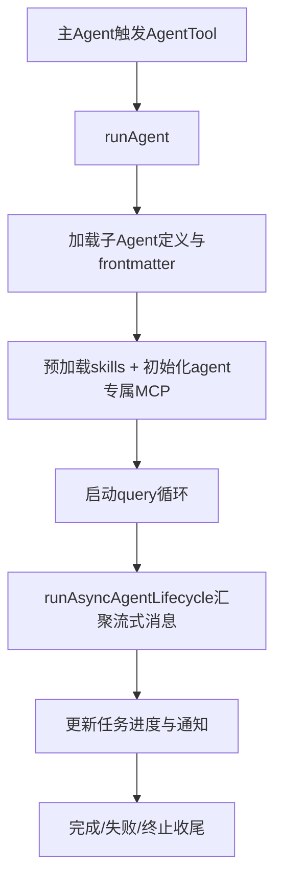

# 03. 子 Agent 设计：分工、通信、协作 🤝

## 🎯 整体架构

子 Agent 模式是主 Agent 的能力拆分系统：

1. 主 Agent 决定是否派发
2. 子 Agent 读取自己的 prompt / tools / skills / MCP 配置
3. 子 Agent 独立跑一套 `query()` 循环
4. 结果流式回传并汇总到主线程

## 🔄 运行流程



## 🧩 设计要点

- 子 Agent 能按类型覆盖模型、工具、技能、MCP 服务，做到“按任务定制”。
- 异步生命周期由 `runAsyncAgentLifecycle` 统一收口，便于状态一致性。
- 任务先标记 `completed` 再做额外通知，防止通知慢阻塞状态流转。
- `resume` 机制可以在中断后从 transcript 继续运行。

## 💻 代码举例

```ts
for await (const message of makeStream(onCacheSafeParams)) {
  agentMessages.push(message)
  updateAsyncAgentProgress(taskId, getProgressUpdate(tracker), rootSetAppState)
}

const agentResult = finalizeAgentTool(agentMessages, taskId, metadata)
completeAsyncAgent(agentResult, rootSetAppState)
```

```ts
const { clients: mergedMcpClients, tools: agentMcpTools } =
  await initializeAgentMcpServers(agentDefinition, toolUseContext.options.mcpClients)
```

## 🛠 持续更新

- 新增 Agent 类型时，补充分工策略与资源边界。
- 新增通信通道时，补充消息一致性和失败补偿逻辑。
- 对协作模式变更（同步/异步）保留版本化说明。
