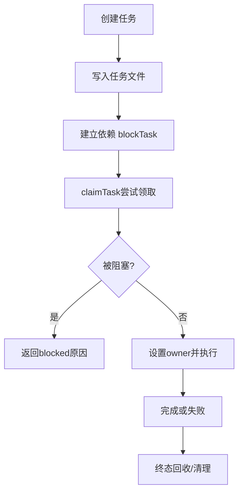

# 04. 任务图：状态机、父子关系、回收机制 🕸️

## 🎯 整体架构

任务图由两层构成：

1. **持久化任务图**：`TaskSchema` + `blocks/blockedBy`，用于任务依赖调度。
2. **运行时任务状态**：后台任务 `pending/running/completed/failed/killed`，用于 UI 与回收。

## 🔄 运行流程



## 🧩 设计要点

- 依赖是双向维护：A.blocks 包含 B，同时 B.blockedBy 包含 A。
- `claimTask` 会原子检查「是否已完成」「是否被阻塞」「是否已被他人领取」。
- 使用文件锁避免多 Agent 并发写任务导致竞态。
- 终态统一通过 `isTerminalTaskStatus` 判定，避免死任务继续接收更新。

## 💻 代码举例

```ts
export const TaskSchema = z.object({
  id: z.string(),
  status: z.enum(['pending', 'in_progress', 'completed']),
  blocks: z.array(z.string()),
  blockedBy: z.array(z.string()),
})
```

```ts
if (blockedByTasks.length > 0) {
  return { success: false, reason: 'blocked', task, blockedByTasks }
}
const updated = await updateTask(taskListId, taskId, { owner: claimantAgentId })
```

## 🛠 持续更新

- 新增状态时同步更新状态机图。
- 调整依赖字段时同步更新父子关系示意。
- 补充回收策略变更（超时、强杀、失败重试）。
