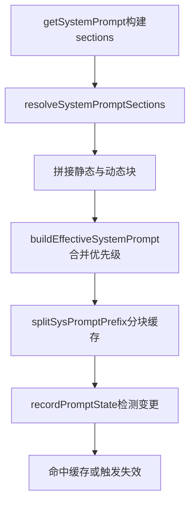

# 05. System Prompt：拼装、分层缓存、失效检测 🧱

## 🎯 整体架构

System Prompt 分三步：

1. **拼装**：静态段 + 动态段（memory、env、language、mcp 等）
2. **合并策略**：default / custom / append / override / agent prompt
3. **缓存策略**：按边界分层缓存，并做 cache break 检测

## 🔄 运行流程



## 🧩 设计要点

- `SYSTEM_PROMPT_DYNAMIC_BOUNDARY` 明确静态与动态边界，便于缓存复用。
- `overrideSystemPrompt` 优先级最高，可直接替换默认策略。
- 动态区中高波动内容可做 uncached section，避免污染静态缓存。
- 通过哈希比对 system/tools/model/betas/extraBody 识别缓存失效根因。

## 💻 代码举例

```ts
return [
  getSimpleIntroSection(outputStyleConfig),
  getSimpleSystemSection(),
  ...(shouldUseGlobalCacheScope() ? [SYSTEM_PROMPT_DYNAMIC_BOUNDARY] : []),
  ...resolvedDynamicSections,
].filter(s => s !== null)
```

```ts
const systemHash = computeHash(strippedSystem)
const toolsHash = computeHash(strippedTools)
const cacheControlHash = computeHash(
  system.map(b => ('cache_control' in b ? b.cache_control : null)),
)
```

## 🛠 持续更新

- 新增 section 时记录其缓存属性（cacheable/uncached）。
- Prompt 合并优先级变更时更新流程图。
- 缓存失效检测字段变更时同步补齐本页说明。
