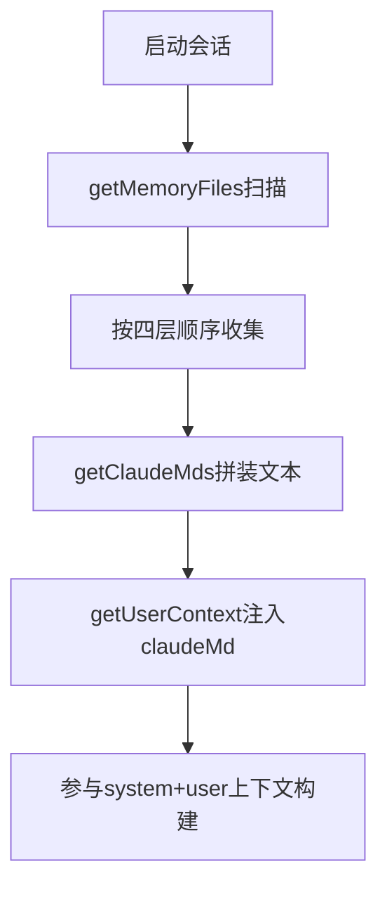

# 07. Memory 系统：会话到跨项目持久化 🧠

## 🎯 整体架构

Memory 采用四层结构（从全局到局部）：

1. Managed memory（系统级）
2. User memory（用户级）
3. Project memory（项目级）
4. Local memory（本地私有）

并在会话上下文阶段统一注入到模型输入中。

## 🔄 运行流程



## 🧩 设计要点

- 目录遍历从当前目录向上，离当前目录越近优先级越高。
- 支持 `@include` 语法引入其他记忆文件，并防循环引用。
- 可以通过开关关闭自动发现，兼顾最小上下文与显式控制。
- Dream/AutoMem 等后台机制可持续整理长期记忆资产。

## 💻 代码举例

```ts
const claudeMd = shouldDisableClaudeMd
  ? null
  : getClaudeMds(filterInjectedMemoryFiles(await getMemoryFiles()))

return {
  ...(claudeMd && { claudeMd }),
  currentDate: `Today's date is ${getLocalISODate()}.`,
}
```

```ts
const memoryLayers = ['managed', 'user', 'project', 'local']
```

## 🛠 持续更新

- 新增 memory 类型时，更新优先级与注入顺序。
- include 规则变化时补充安全边界说明。
- 补充跨会话持久化策略演进。
