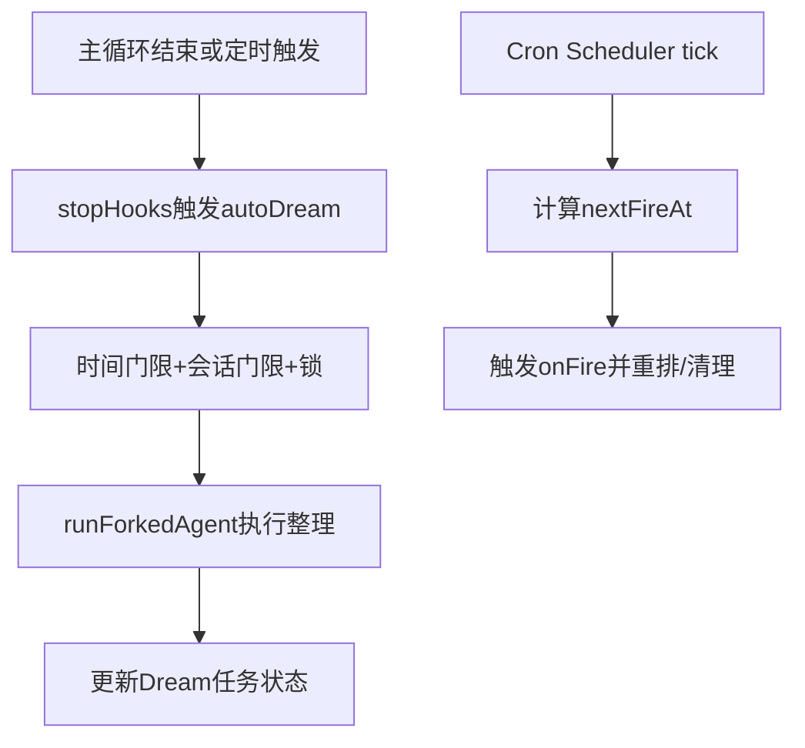

# 08. 后台任务：后台 Agent、Cron、Dream 整理 ⚙️

## 🎯 整体架构

后台系统包含三类能力：

1. **后台 Agent**：异步执行长任务并回传进度。
2. **Cron 调度**：按计划触发 prompt 或任务。
3. **Dream 记忆整理**：定期扫描历史会话并做记忆巩固。

## 🔄 运行流程



## 🧩 设计要点

- Dream 采用多级 gate（时间、会话数量、锁）避免频繁打扰主流程。
- Cron 使用文件持久化 + tick 检查 + inFlight 防重，减少重复触发。
- 后台任务状态统一进入任务面板，支持完成、失败、杀死。
- 被用户中断时，Dream 会回滚锁状态，避免后续调度卡住。

## 💻 代码举例

```ts
if (!force && hoursSince < cfg.minHours) return
sessionIds = sessionIds.filter(id => id !== getSessionId())
if (!force && sessionIds.length < cfg.minSessions) return

const taskId = registerDreamTask(setAppState, {
  sessionsReviewing: sessionIds.length,
  priorMtime,
  abortController,
})
```

```ts
if (now < next) return
if (onFireTask) {
  onFireTask(t)
} else {
  onFire(t.prompt)
}
```

## 🛠 持续更新

- 记录 Cron 规则扩展（jitter、老化、missed 策略）变更。
- 记录 Dream gate 参数调整与触发频率变化。
- 维护后台任务状态与 UI 展示的一致性说明。
