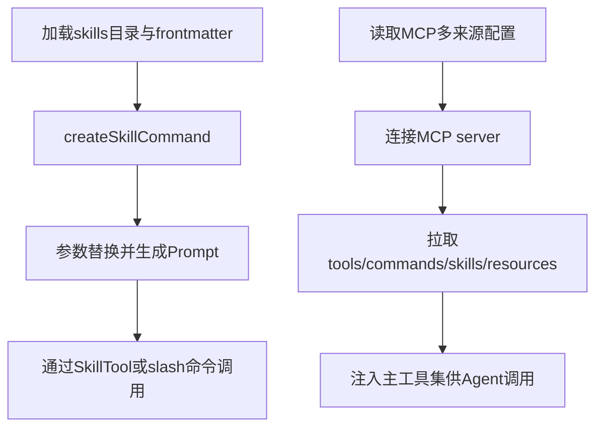

# 09. Skill 与 MCP：Prompt 模板 + 外部服务协议 🔌

## 🎯 整体架构

扩展层由两部分组成：

1. **Skill**：可复用的 Prompt 模板能力（支持参数替换、执行上下文）。
2. **MCP**：外部服务协议层，动态挂载工具、命令、资源、技能。

## 🔄 运行流程



## 🧩 设计要点

- Skill 具备模板能力：参数替换、上下文模式、可见性、可调用权限。
- MCP 配置按 scope 合并，并受策略、审批、去重逻辑约束。
- 远端 MCP skill 默认不执行内联 shell，减少远端内容执行风险。
- Agent frontmatter 支持按 Agent 绑定 skills/mcpServers，实现能力隔离。

## 💻 代码举例

```ts
finalContent = substituteArguments(finalContent, args, true, argumentNames)
if (loadedFrom !== 'mcp') {
  finalContent = await executeShellCommandsInPrompt(finalContent, wrappedContext, `/${skillName}`, shell)
}
```

```ts
const [tools, mcpCommands, mcpSkills, resources] = await Promise.all([
  fetchToolsForClient(client),
  fetchCommandsForClient(client),
  fetchMcpSkillsForClient(client),
  fetchResourcesForClient(client),
])
```

## 🛠 持续更新

- 新增 Skill frontmatter 字段时补充模板能力说明。
- MCP 合并优先级变更时更新本页合并规则。
- 新增资源类型时补充工具注入与权限边界。
